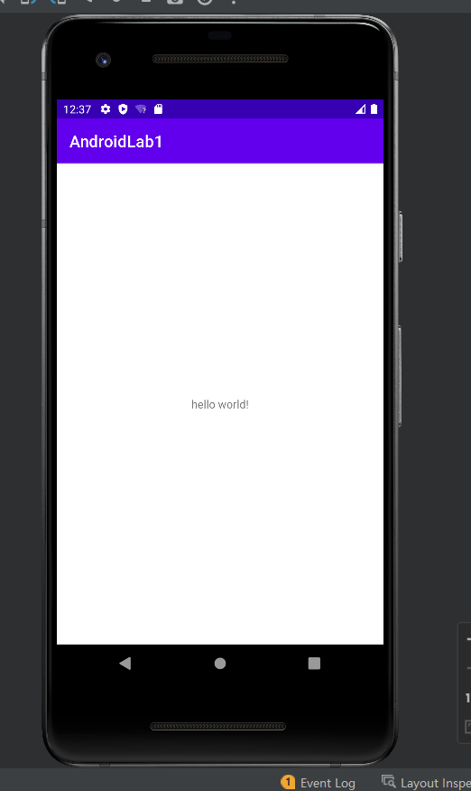

# AndroidLab1 Hello World
#### 创建第一个安卓文件

###### 步骤

①File -> New -> New Project -> Empty Activity -> Next -> 命名AndroidLab1 -> Finish

②res -> layout -> activity_main.xml

③插入一个text view居中显示，内容为hello world！，文字内容通过@string关联values->strings.xml内的文字展现

##### 关键代码

```
<TextView    android:layout_width="wrap_content"    android:layout_height="wrap_content"    android:text="@string/hello"    app:layout_constraintBottom_toBottomOf="parent"    app:layout_constraintEnd_toEndOf="parent"    app:layout_constraintStart_toStartOf="parent"    app:layout_constraintTop_toTopOf="parent" />
```

##### 效果截图


